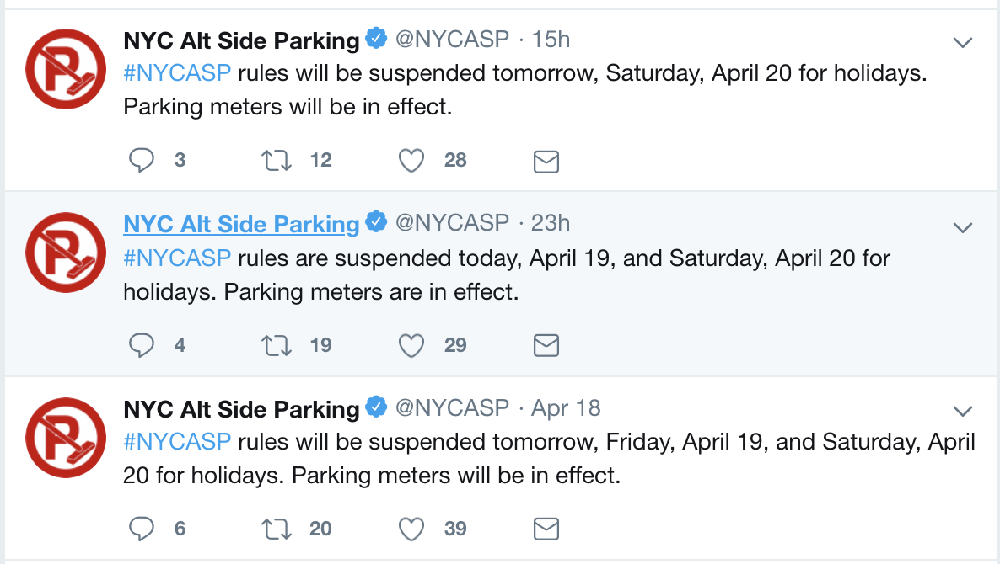
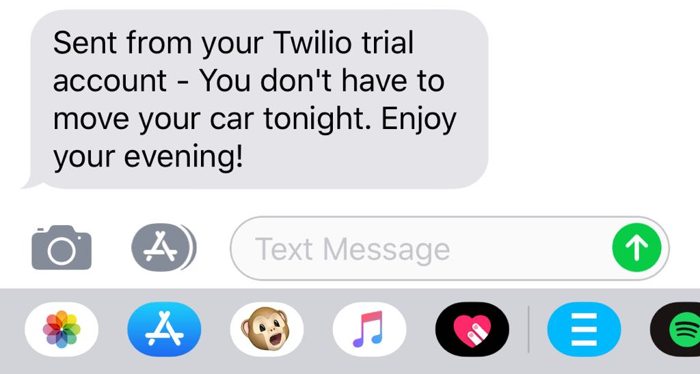

# NYCASP - Parking Notifier
[](https://heroku.com/deploy)


> Tweeting NYC ASP info daily at 7:30 AM, 4 PM, & during emergency suspensions. Account is automated and will not respond



Inspired by [this article](https://dev.to/twitterdev/how-i-solved-my-nyc-parking-problem-with-python-the-search-tweets-api-and-twilio-1chp) I decided to create a minimalistic and simple solution in Ruby. And here there is!

When there in no need to move your car, you will get the text message!


## Usage

### Locally

#### 1. Setup your credentials by filling the `secrets.yml` file:
```yaml
twitter_api:
  api_key: api-key
  api_secret_key: api-secret-key
  access_token: access-token
  access_secret_token: access-secret-token
twilio:
  account_sid: account-sid
  auth_token: auth-token
  from_number: from-number
  to_number: to-number

```
You can start by copying the `secrets.yml` file:
```bash
cp secrets.example.yml
```

#### 2. Run the script
```bash
make run
```

## TODO:
1. Describe the setup with Cron locally.
2. Describe the automated setup on Heroku.
